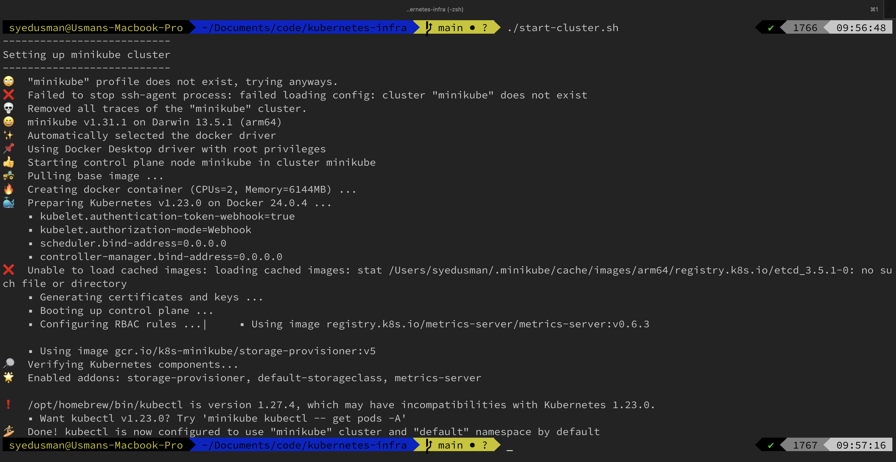
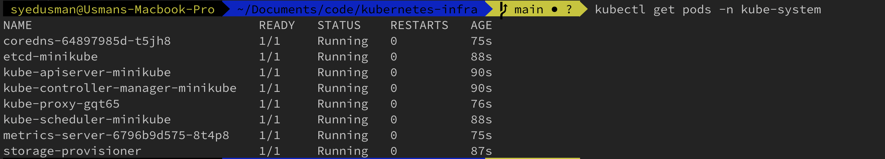
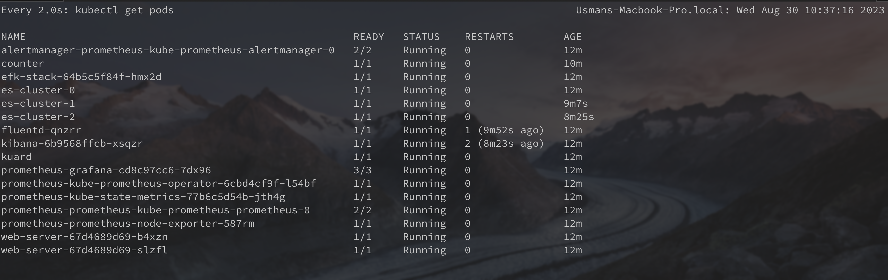
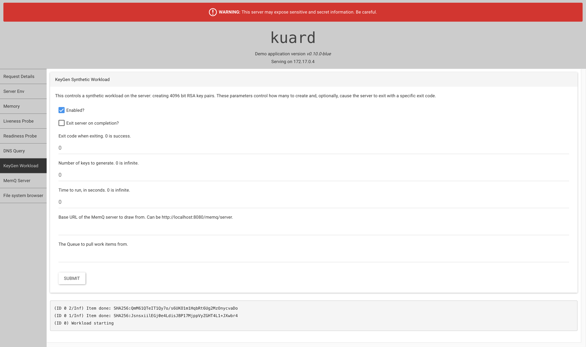
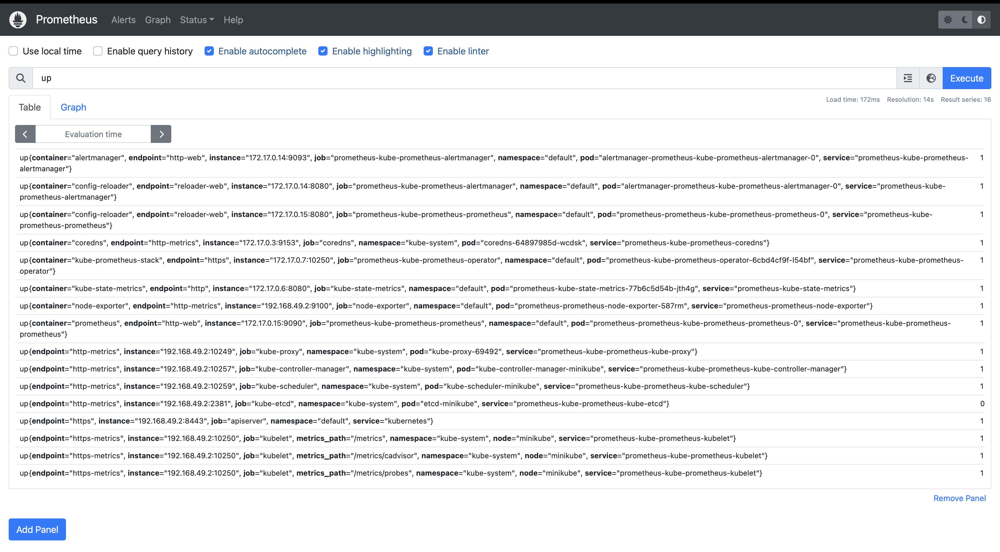
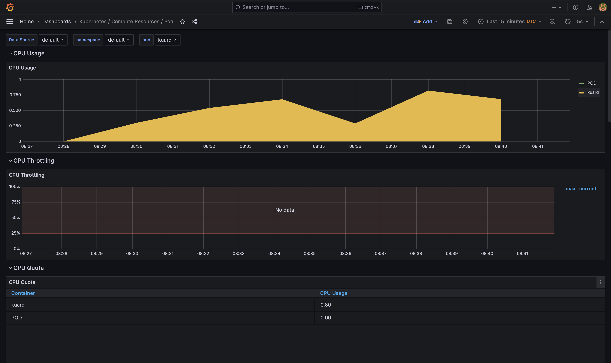
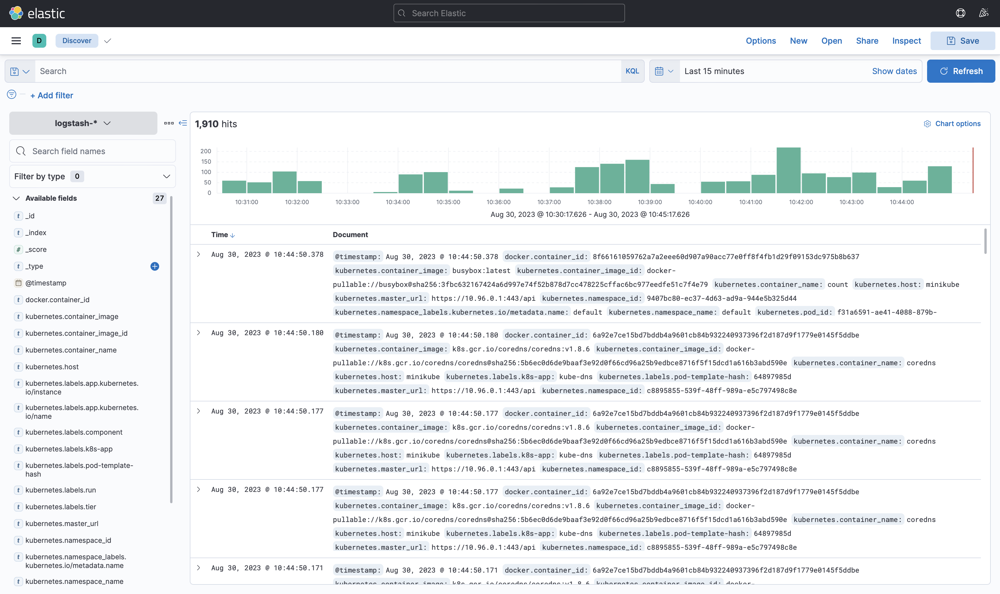

In this document, I will (attempt to) explain each part of the solution, and showcase my thinking process. Below you will also find answers to questions from the task.

# Part 0 - Setup

Started minikube from script ```start-cluster.sh```, with some config. 


`--extra-config=kubelet.authentication-token-webhook=true \`: configuring the kubelet to use the authentication token webhook, later needed so that elasticsearch & kibana pods can speak to each other

`--extra-config=kubelet.authorization-mode=Webhook \`: Use `Webhook` mode for authorization. also needed so that elasticsearch and Kibana pods can speak to each other

`--addons=metrics-server`: This option specifies the addons to enable. In this case, it is specifying to enable the `metrics-server` addon. Needed for the Horizontal pod autoscaler to function. 


Observe that the metrics server is running (as specified): 


Next, I ran the ```setup.sh``` script. It 
- installs the [kube–premetheus-stack](https://github.com/prometheus-community/helm-charts/tree/main/charts/kube-prometheus-stack#kube-prometheus-stack) using [helm chart](https://prometheus-community.github.io/helm-charts) in the monitoring namespace
- Packages and installs the efk-stack (elasticsearch, fluentd, kibana) using helm. 
- Creates a pod that generates random logs and another pod that has an nginx webserver to test scaling. 

Then I waited for everything to start up properly:


Also, port-forwarded all apps for local access using
```port-forward.sh```
---
Verify everything is running:

#### kuard

#### prometheus

#### grafana



#### elasticsearch


#### fluentd daemonset

#### kibana



# Part 1 - Logging 
### How would a logging solution look in a Kubernetes environment?


Logging is a critical aspect of managing and troubleshooting both applications and the underlying infrastructure in a Kubernetes environment. Here's a breakdown of how these components typically interact to handle log collection, storage, and analysis:

1. **Log Creation**: Applications running in a Kubernetes cluster, as well as Kubernetes itself, generate logs that are typically directed to the standard output (stdout) and standard error (stderr) streams of the container.

2. **Log Collection**: A log collection agent, such as Fluentd, Fluentbit, Filebeat or Logstash is deployed on each node in the Kubernetes cluster as a DaemonSet. This agent is responsible for gathering logs from the containers on its node and any other relevant log files. The agent can also perform initial log processing tasks, such as parsing, filtering, and adding additional metadata. For instance, Fluentd can parse JSON-formatted log messages and append Kubernetes metadata like pod names, namespace, and labels.

4. **Log Aggregation**: The processed logs are then forwarded to a central log aggregation tool, such as Elasticsearch or a managed logging service like AWS CloudWatch or Google Stackdriver. This tool stores the logs and makes them searchable and analyzable.

5. **Log Analysis**: A log analysis tool, such as Kibana or Grafana, is used to visualize and analyze the logs. These tools offer dashboards, query capabilities, and alerting features to aid in monitoring applications and infrastructure.


# Describe how the components of a possible logging solution work together.

The Elasticsearch, Fluentd, and Kibana stack is a popular open-source logging solution. Below is a breakdown of how each component works individually and how they work together:

1. **Elasticsearch**: This is a search and analytics engine that stores and indexes the log data. It is designed to be distributed, which means it can scale horizontally to handle large volumes of data.

2. **Fluentd**: This is a log collector and processor. It collects log data from various sources, processes it, and sends it to Elasticsearch for storage and indexing.

3. **Kibana**: This is a web-based user interface for Elasticsearch. It allows you to search, analyze, and visualize the log data stored in Elasticsearch.

**How They Work Together**:

1. **Log Collection**: The first step in the logging process is to collect the log data. Fluentd is responsible for this. It collects log data from various sources, such as log files, system logs, or application logs. Fluentd configuration below collects logs from a file: `/var/log/app.log`. The `path` parameter specifies the path to the log file, and the `format` parameter specifies the format of the log data (in this case, JSON).
 ```
 <source>
 @type tail
 path /var/log/app.log
 pos_file /var/log/app.log.pos
 tag app.log
 format json
 </source>
 ```
 

2. **Log Processing**: Once the log data is collected, it can be processed before going to elasticsearch for storage/analysis. Fluentd processes the log data by adding metadata, filtering, and transforming the log data e.g. we can use filters in Fluentd config to add a `hostname` field to the log data. The `record_transformer` filter is used to add or modify fields in the log data.
 ```
 <filter app.log>
 @type record_transformer
 <record>
 hostname "#{Socket.gethostname}"
 </record>
 </filter>
 ```
 

3. **Log Aggregation**: Once the log data is processed, it needs to be sent to a central location for storage and indexing. Fluentd sends the processed log data to Elasticsearch.
 ```
 <match app.log>
 @type elasticsearch
 host elasticsearch
 port 9200
 index_name app-log
 type_name log
 </match>
 ```
 In this Fluentd configuration, Fluentd is configured to send the processed log data to an Elasticsearch instance running on a host named `elasticsearch` and listening on port `9200`. The `index_name` parameter specifies the name of the Elasticsearch index to store the log data, and the `type_name` parameter specifies the type of the log data.

4. **Log Analysis and Visualization**: Once the log data is stored and indexed in Elasticsearch, it can be visualized using Kibana. Let's say you are running a web application, and you want to monitor the response times of your application. You can configure Fluentd to collect the response times from your application logs, send the data to Elasticsearch, and then use Kibana to create a visualization that shows the response times over time.
 ```
 GET /app-log/_search
 {
 "query": {
 "range": {
 "@timestamp": {
 "gte": "now-1d/d",
 "lt": "now/d"
 }
 }
 },
 "aggs": {
 "avg_response_time": {
 "avg": {
 "field": "response_time"
 }
 }
 }
 }
 ```
In this Elasticsearch query, we are searching for all log entries in the `app-log` index with a timestamp in the last 24 hours. We are also calculating the average response time using the `response_time` field in the log data. In Kibana, you can use this query to create a visualization that shows the average response time over time. This ends the long journey of the log entry from the ``` container -> node -> fluentd -> elasticsearch -> kibana -> engineer```


# Part - 2 Scaling
Question: How can Kubernetes' built-in tools ensure that the application can handle a high number of requests?

Kubernetes has built-in tools that can help your application handle a high number of requests:

- Horizontal Pod Autoscaler (HPA): This is a Kubernetes component that automatically adjusts the number of pod replicas in a Deployment or ReplicaSet based on observed CPU utilization or other select metrics. (important to note that this depends on the metrics-server)
- LoadBalancer and Ingress: These components distribute incoming requests across all your pods.
- Resource Requests and Limits: By setting these values, Kubernetes can better manage the node resources and ensure that your application has the necessary CPU and memory to handle the load.


To observe the horizontal scaling, I created a stock nginx webserver ```web-server-deployment.yaml```
I then exposed it using a simple service ```web-server-service.yaml```
I then created a Horizontal Pod Autoscaler which would manage the number of replicas of the server based on the load ```web-server-hpa.yaml```

I then tried to stress it with a lot of requests from the terminal. 
ab -n 100000 -c 100 http://localhost:8080/
Was fruitless as it did not scale as the CPU did not even go up, I could not stress it enough. 

# Part - 3
### How can you detect errors in templating before deployment?

There are several ways to find errors:

- **Use `helm lint`**: The `helm lint` command can be used to identify issues with your Helm chart. It checks the chart for stuff like missing required values or incorrect template formatting.
 ```
 helm lint efk-stack/efk-stack
 ==> Linting efk-stack/efk-stack
 [INFO] Chart.yaml: icon is recommended
 1 chart(s) linted, 0 chart(s) failed
 ```

- **Use `helm template`**: The `helm template` command can be used to render templates locally without deploying them to the cluster. This can help you identify any syntax errors or missing values in your templates.

 ```
 helm template efk-stack/efk-stack
 ```

- **Use `kubectl dry-run`**: The `kubectl apply --dry-run=client` command can be used to validate Kubernetes manifests without actually applying them to the cluster. This can help identify issues, such as missing required fields or incorrect API versions.

 ```
 kubectl apply --dry-run=client -f /path/to/manifest.yaml
 ```

- **Use a Validation Tool**: There are several third-party tools available that can help you validate your Kubernetes manifests, such as kubeval or kube-score. These tools can help you identify common issues with your manifests, such as missing required fields or incorrect API versions.

 ```
 kubeval /path/to/manifest.yaml
 ```


### What options are there to revert a failed deployment to a previous version?

- you can use the helm rollback command to rollback a release to a previous revision.
 ```
 helm rollback my-release
 ```
 If you want to rollback to a specific revision, you can specify the revision number:
 ```
 helm rollback my-release 4
 ```

- if not using helm, kubectl can be used
 ```
 kubectl rollout undo deployment/my-deployment --to-revision=2
 ```
- Otherwise, just go ahead and apply the previous version, but it is not the best approach.

### What metrics does the demo application offer? Which CI/CD tool would be your tool of choice?

##### Metrics
Here are the metrics exposed by kuard over http://localhost:8080/metrics:

1. Go Metrics:
    - GC invocation durations
    - Number of goroutines
    - Go environment information
    - Memory stats
    - Number of OS threads created

2. HTTP Metrics:
    - Request latencies in microseconds
    - Request sizes in bytes
    - Total number of HTTP requests made
    - Response sizes in bytes

3. Process Metrics:
    - Total user and system CPU time spent in seconds
    - Maximum number of open file descriptors
    - Number of open file descriptors
    - Resident memory size in bytes
    - Start time of the process since unix epoch in seconds
    - Virtual memory size in bytes
    - Maximum amount of virtual memory available in bytes

4. Request Duration Metrics:
    - Time serving HTTP request for different routes, status codes, and methods


I would use jenkins, because it is free, open source and has a plethora of plugins. Ideally, would deploy it somewhere in the cloud, do proper permission management and use it to build/test/deploy.


---
1. **How do I place the applications behind an Ingress Controller, and what are Ingress Controllers used for?**

   Ingress Controllers are used for managing access to services in your Kubernetes cluster by external clients. It acts as a reverse proxy and load balancer that routes external HTTP/S traffic to the services.

   Here is an example of an Ingress resource:
   ```yaml
   apiVersion: networking.k8s.io/v1
   kind: Ingress
   metadata:
     name: example-ingress
     annotations:
       nginx.ingress.kubernetes.io/rewrite-target: /
   spec:
     rules:
     - host: www.example.com
       http:
         paths:
         - path: /app1
           pathType: Prefix
           backend:
             service:
               name: app1-service
               port:
                 number: 80
         - path: /app2
           pathType: Prefix
           backend:
             service:
               name: app2-service
               port:
                 number: 80
   ```

2. **What would alerting in the Kubernetes Cluster look like? What options are there? What options are there to fill the TSDB (Time-Series-Database) of a Prometheus server with metrics?**

   Alerting can be set up using the Alertmanager from Prometheus. 

   You can configure Prometheus to set up alerting rules. When an alerting rule is triggered, Prometheus sends an alert to Alertmanager, which then sends the alert to the configured receiver (e.g., email, Slack).

   Here is an example of a Prometheus configuration file with an alerting rule:
   ```yaml
   global:
     scrape_interval: 15s

   alerting:
     alertmanagers:
     - static_configs:
       - targets:
         - 'alertmanager:9093'

   rule_files:
     - "alerting_rules.yml"
   ```

   And here is an example of an alerting rule:
   ```yaml
   groups:
   - name: example
     rules:
     - alert: HighRequestLatency
       expr: http_request_duration_seconds{quantile="0.5"} > 1
       for: 10m
       labels:
         severity: page
       annotations:
         summary: "High request latency on {{ $labels.instance }}"
   ```

3. **What options are there to store sensitive data such as secrets in a GIT repository, and which one would you choose?**

   Storing sensitive data in a Git repository is a bad idea. If you must, encrypt the data before committing it to the repository. 
   
   I never had to do it, but i would use a tool that manages the private keys for encryption so I dont have to. From a web search i found one option is to use a tool like SOPS (Secrets OPerationS) which supports multiple key management services, such as AWS KMS, GCP KMS, and Azure Key Vault.

   Here is an example of how to use SOPS to encrypt a file:
   ```
   sops --encrypt --gcp-kms projects/my-project/locations/global/keyRings/my-keyring/cryptoKeys/my-key secrets.yaml > secrets.enc.yaml
   ```

   And then you can decrypt the file with:
   ```
   sops --decrypt secrets.enc.yaml > secrets.yaml
   ```

4. **What options are there to completely remove sensitive data that was mistakenly stored in plain text in the GIT repository?**

   If you mistakenly committed sensitive data in plain text to a Git repository, you need to remove the sensitive data from the Git history.

   One option is to use the `git filter-branch` command to rewrite the Git history and remove the sensitive data. However, this can be a complex and error-prone process.

   Another option is to use a tool like BFG Repo-Cleaner, which is a simpler and faster alternative to `git filter-branch`.

   Here is an example of how to use BFG Repo-Cleaner to remove a file containing sensitive data from a Git repository:
   ```
   git clone --mirror git://example.com/some-big-repo.git
   bfg --delete-files secrets.yaml some-big-repo.git
   cd some-big-repo.git
   git reflog expire --expire=now --all && git gc --prune=now --aggressive
   git push
   ```

   After you remove the sensitive data from the Git repository, you should also change the sensitive data (e.g., passwords, API keys) because it may have been exposed.
   
   source: https://docs.github.com/en/authentication/keeping-your-account-and-data-secure/removing-sensitive-data-from-a-repository#
